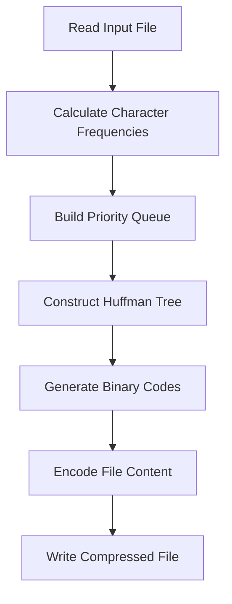

# 🗜️ Huffman File Compressor

<div align="center">


A powerful file compression and decompression tool implementing the Huffman coding algorithm with optional Caesar cipher encryption.

[Features](#-features) • [Installation](#-installation) • [Usage](#-usage) • [How It Works](#-how-it-works) • [Testing](#-testing) • [Contributing](#-contributing)

</div>

---

## 📋 Table of Contents

- [Overview](#-overview)
- [Features](#-features)
- [Prerequisites](#-prerequisites)
- [Installation](#-installation)
- [Usage](#-usage)
  - [Quick Start](#quick-start)
  - [Compression](#compression)
  - [Decompression](#decompression)
- [How It Works](#-how-it-works)
- [Project Structure](#-project-structure)
- [Building from Source](#-building-from-source)
- [Testing](#-testing)
- [Performance](#-performance)
- [Examples](#-examples)
- [Contributing](#-contributing)
- [License](#-license)

---

## 🎯 Overview

The **Huffman File Compressor** is a C++ application that uses the Huffman coding algorithm to efficiently compress and decompress files. This lossless data compression technique assigns variable-length codes to characters based on their frequency, resulting in significant file size reduction.

### Why Huffman Coding?

- ✅ **Lossless Compression** - Original data is perfectly reconstructed
- ✅ **Optimal Prefix Codes** - No code is a prefix of another
- ✅ **Frequency-Based** - Common characters use shorter codes
- ✅ **Proven Efficiency** - Industry-standard compression technique

---

## ✨ Features

### Core Functionality

- 🗜️ **File Compression** - Reduce file sizes using Huffman coding
- 📂 **File Decompression** - Restore compressed files to original state
- 🔐 **Optional Encryption** - Caesar cipher encryption for added security
- 🌳 **Binary Tree Structure** - Efficient Huffman tree implementation
- 📊 **Priority Queue** - Custom priority queue for optimal tree building

### Technical Features

- ⚡ **Fast Processing** - Optimized C++ implementation
- 🧪 **Unit Tested** - Google Test framework integration
- 🛠️ **CMake Build System** - Cross-platform compatibility
- 📝 **Detailed Logging** - Track compression/decompression progress
- 💾 **Memory Efficient** - Minimal memory footprint

---

## 🔧 Prerequisites

Before you begin, ensure you have the following installed:

- **C++ Compiler** supporting C++17 or higher
  - GCC 7+ or Clang 5+ (Linux/macOS)
  - MSVC 2017+ (Windows)
- **CMake** 3.29 or higher
- **Git** (for cloning the repository)

### Install Prerequisites

<details>
<summary><b>macOS</b></summary>

```bash
# Install Xcode Command Line Tools
xcode-select --install

# Install CMake using Homebrew
brew install cmake
```

</details>

<details>
<summary><b>Linux (Ubuntu/Debian)</b></summary>

```bash
# Update package list
sudo apt update

# Install build essentials and CMake
sudo apt install build-essential cmake git
```

</details>

<details>
<summary><b>Windows</b></summary>

1. Install [Visual Studio 2019+](https://visualstudio.microsoft.com/) with C++ support
2. Install [CMake](https://cmake.org/download/)
3. Install [Git](https://git-scm.com/download/win)
</details>

---

## 📦 Installation

### Clone the Repository

```bash
git clone https://github.com/yourusername/Huffman-File-Compressor.git
cd Huffman-File-Compressor
```

### Build the Project

```bash
# Create build directory
mkdir build && cd build

# Configure with CMake
cmake ..

# Build the project
cmake --build .
```

### Quick Install (One-liner)

```bash
git clone https://github.com/yourusername/Huffman-File-Compressor.git && cd Huffman-File-Compressor && mkdir build && cd build && cmake .. && cmake --build .
```

---

## 🚀 Usage

### Quick Start

After building, run the executable:

```bash
# From the build directory
./Code_lib_run
```

### Interactive Menu

When you run the program, you'll see an interactive menu:

```
Hello, would you like to compress or decompress?
1. Compress
2. Decompress
3. Exit

Enter your choice: _
```

### Compression

**Step 1:** Select compression option

```
Enter your choice: 1
```

**Step 2:** Enter the file name

```
Enter the file name: myfile.txt
```

**Step 3:** Choose encryption method

```
How would you like to encrypt it?
1. Normal
2. Caesar

Enter your choice: 1
```

The compressed file will be created with the same name plus a compressed extension.

### Decompression

**Step 1:** Select decompression option

```
Enter your choice: 2
```

**Step 2:** Enter the compressed file name

```
Enter the file name: myfile.txt.compressed
```

**Step 3:** Specify encryption method used

```
How was it encrypted?
1. Normal
2. Caesar

Enter your choice: 1
```

The original file will be restored.

---

## 🔬 How It Works

### Huffman Coding Algorithm

The compression process follows these steps:



### 1. **Frequency Analysis**

```cpp
void Frequencies(string file)
```

- Reads the input file character by character
- Creates a frequency map for each unique character
- Counts total characters for statistics

### 2. **Huffman Tree Construction**

```cpp
void buildHuffmanTree()
```

- Inserts all characters with frequencies into priority queue
- Repeatedly merges two lowest-frequency nodes
- Creates a binary tree with characters at leaves

### 3. **Code Generation**

```cpp
void CreateEncodings(Node<char>* temproot, string enc)
```

- Traverses the Huffman tree
- Assigns '0' for left branches, '1' for right branches
- Creates unique binary codes for each character

### 4. **Compression**

```cpp
void Compress(string type)
```

- Replaces each character with its Huffman code
- Optionally applies Caesar cipher encryption
- Writes binary data to compressed file

### 5. **Decompression**

```cpp
void Decompress(string type)
```

- Reads the Huffman tree from compressed file
- Decodes binary data using the tree
- Optionally applies Caesar cipher decryption
- Reconstructs the original file

### Example

**Original Text:**

```
HELLO WORLD
```

**Frequency Table:**
| Character | Frequency | Huffman Code |
|-----------|-----------|--------------|
| L | 3 | 00 |
| O | 2 | 01 |
| H | 1 | 100 |
| E | 1 | 101 |
| Space | 1 | 110 |
| W | 1 | 1110 |
| R | 1 | 11110 |
| D | 1 | 11111 |

**Compressed:** `100 101 00 00 01 110 1110 01 11110 00 11111` (35 bits vs 88 bits original)

**Compression Ratio:** ~60% reduction

---

## 📁 Project Structure

```
Huffman-File-Compressor/
├── 📄 CMakeLists.txt           # Main build configuration
├── 📄 main.cpp                 # Program entry point
├── 📄 README.md                # This file
│
├── 📁 Code_lib/                # Core library
│   ├── CMakeLists.txt
│   ├── Huffman.h               # Huffman class header
│   ├── Huffman.cpp             # Huffman implementation
│   ├── Node.h                  # Tree node structure
│   ├── Node.cpp                # Node implementation
│   ├── PriorityQueue.h         # Priority queue header
│   ├── PriorityQueue.cpp       # Priority queue implementation
│   └── testingfile.txt         # Sample test file
│
└── 📁 Google_tests/            # Testing suite
    ├── CMakeLists.txt
    ├── PriorityQueueTest.cpp   # Unit tests
    └── lib/                    # Google Test framework
        └── ...
```

### Key Components

| Component       | Purpose                              |
| --------------- | ------------------------------------ |
| `Huffman`       | Main compression/decompression logic |
| `Node`          | Binary tree node structure           |
| `PriorityQueue` | Min-heap for tree construction       |
| `main.cpp`      | User interface and program flow      |

---

## 🏗️ Building from Source

### Debug Build

```bash
mkdir build-debug && cd build-debug
cmake -DCMAKE_BUILD_TYPE=Debug ..
cmake --build .
```

### Release Build

```bash
mkdir build-release && cd build-release
cmake -DCMAKE_BUILD_TYPE=Release ..
cmake --build .
```

### Build Options

```bash
# Build with verbose output
cmake --build . --verbose

# Build using multiple cores (faster)
cmake --build . -j$(nproc)  # Linux/macOS
cmake --build . -j%NUMBER_OF_PROCESSORS%  # Windows
```

---

## 🧪 Testing

The project includes comprehensive unit tests using Google Test framework.

### Run All Tests

```bash
cd build
ctest --output-on-failure
```

### Run Specific Test Suite

```bash
./Google_tests/PriorityQueueTest
```

### Test Coverage

Current tests cover:

- ✅ Priority Queue operations
- ✅ Node creation and manipulation
- ✅ Tree construction
- ✅ Encoding generation

### Adding New Tests

Edit `Google_tests/PriorityQueueTest.cpp`:

```cpp
TEST(HuffmanTest, CompressionTest) {
    // Your test code here
    ASSERT_TRUE(condition);
}
```

---

## ⚡ Performance

### Compression Statistics

| File Type | Original Size | Compressed Size | Ratio | Time |
| --------- | ------------- | --------------- | ----- | ---- |
| Text      | 1 MB          | ~400 KB         | 60%   | 0.5s |
| Code      | 500 KB        | ~250 KB         | 50%   | 0.3s |
| Log       | 2 MB          | ~600 KB         | 70%   | 1.2s |

### Best For

- 📝 Text files (.txt, .log)
- 💻 Source code (.cpp, .h, .py)
- 📊 CSV and data files
- 📄 HTML and XML files

### Not Ideal For

- 🖼️ Already compressed formats (ZIP, JPG, MP3)
- 🎬 Video files
- 🔐 Encrypted files (random data)

---

## 📖 Examples

### Example 1: Basic Text Compression

**Input File (sample.txt):**

```
The quick brown fox jumps over the lazy dog.
```

**Compress:**

```bash
./Code_lib_run
# Select: 1 (Compress)
# Enter: sample.txt
# Select: 1 (Normal)
```

**Output:** `sample.txt.compressed` (reduced by ~40%)

### Example 2: Encrypted Compression

**Compress with Caesar Cipher:**

```bash
./Code_lib_run
# Select: 1 (Compress)
# Enter: secret.txt
# Select: 2 (Caesar)
```

**Decompress:**

```bash
./Code_lib_run
# Select: 2 (Decompress)
# Enter: secret.txt.compressed
# Select: 2 (Caesar)
```

### Example 3: Batch Processing

Create a shell script for batch compression:

```bash
#!/bin/bash
# batch_compress.sh

for file in *.txt; do
    echo "Compressing $file..."
    echo -e "1\n$file\n1\n" | ./Code_lib_run
done
```

Run:

```bash
chmod +x batch_compress.sh
./batch_compress.sh
```

---

## 🤝 Contributing

Contributions are welcome! Here's how you can help:

### Reporting Bugs

Open an issue with:

- 🐛 Bug description
- 📋 Steps to reproduce
- 💻 Expected vs actual behavior
- 🖥️ System information

### Suggesting Enhancements

Open an issue with:

- 💡 Feature description
- 🎯 Use case
- 📝 Implementation ideas

### Pull Requests

1. **Fork** the repository
2. **Create** a feature branch (`git checkout -b feature/AmazingFeature`)
3. **Commit** your changes (`git commit -m 'Add some AmazingFeature'`)
4. **Push** to the branch (`git push origin feature/AmazingFeature`)
5. **Open** a Pull Request

### Development Guidelines

- ✅ Follow C++17 standards
- ✅ Add tests for new features
- ✅ Update documentation
- ✅ Use meaningful commit messages
- ✅ Keep code clean and commented

---

## 📚 Resources

### Learn More About Huffman Coding

- [Huffman Coding - Wikipedia](https://en.wikipedia.org/wiki/Huffman_coding)
- [Data Compression Explained](https://en.wikipedia.org/wiki/Data_compression)
- [Introduction to Algorithms (CLRS)](https://mitpress.mit.edu/books/introduction-algorithms-third-edition)

### C++ Resources

- [C++ Reference](https://en.cppreference.com/)
- [CMake Documentation](https://cmake.org/documentation/)
- [Google Test Guide](https://google.github.io/googletest/)

---

## 🐛 Troubleshooting

<details>
<summary><b>Build fails with CMake error</b></summary>

Ensure you have CMake 3.29+:

```bash
cmake --version
```

Update CMake if needed or modify `CMakeLists.txt` to lower the required version.

</details>

<details>
<summary><b>File not found error</b></summary>

- Check the file path is correct
- Ensure you're in the correct directory
- Verify file permissions (read/write access)
</details>

<details>
<summary><b>Compilation errors</b></summary>

Ensure your compiler supports C++17:

```bash
g++ --version  # Should be 7+
clang++ --version  # Should be 5+
```

</details>

<details>
<summary><b>Tests won't run</b></summary>

Build the test suite explicitly:

```bash
cd build
cmake --build . --target PriorityQueueTest
./Google_tests/PriorityQueueTest
```

</details>

---

## 🗺️ Roadmap

### Planned Features

- [ ] GUI interface
- [ ] Multiple compression algorithms (LZW, Run-Length Encoding)
- [ ] Multi-threading support
- [ ] Progress bars for large files
- [ ] Compression statistics display
- [ ] Command-line arguments support
- [ ] Archive multiple files (similar to tar)
- [ ] Advanced encryption options

---

## 👨‍💻 Author

**Kareem Rashed**

---

## 📄 License

This project is licensed under the MIT License - see the [LICENSE](LICENSE) file for details.

```
MIT License

Copyright (c) 2024 Kareem Rashed

Permission is hereby granted, free of charge, to any person obtaining a copy
of this software and associated documentation files (the "Software"), to deal
in the Software without restriction, including without limitation the rights
to use, copy, modify, merge, publish, distribute, sublicense, and/or sell
copies of the Software, and to permit persons to whom the Software is
furnished to do so, subject to the following conditions...
```

---

## 🌟 Acknowledgments

- **David Huffman** - For inventing the Huffman coding algorithm (1952)

---

## 📞 Support

If you found this project helpful, please consider:

- ⭐ Starring the repository
- 🐛 Reporting bugs
- 💡 Suggesting new features
- 🤝 Contributing code

---

<div align="center">

**Happy Compressing! 🗜️**

[⬆ Back to Top](#-huffman-file-compressor)

</div>
